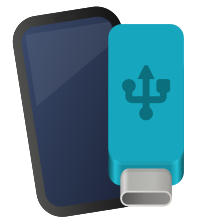
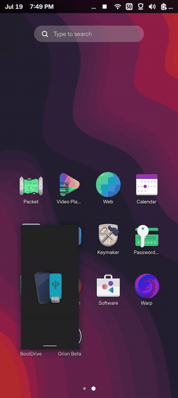
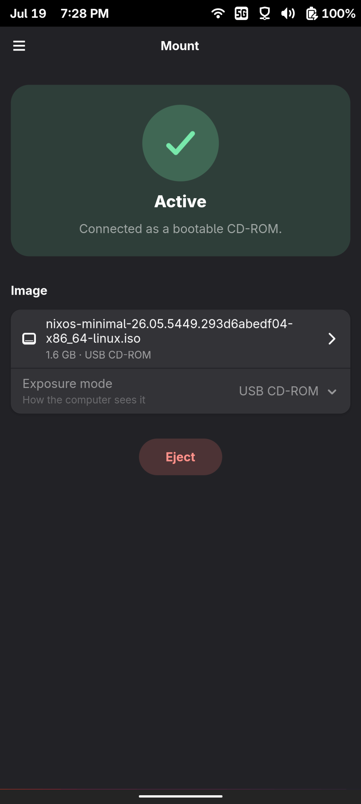
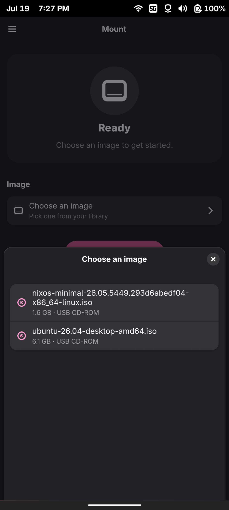
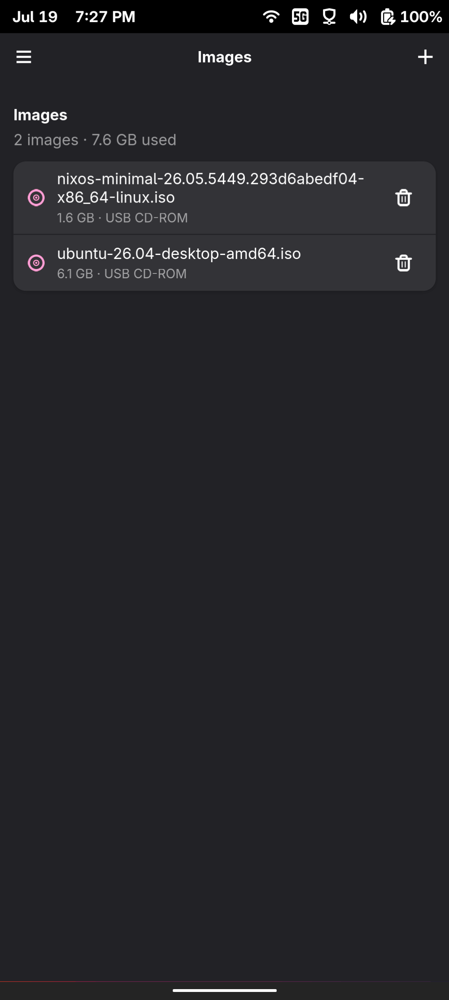

<div align="center">
  

  <h1>BootDrive</h1>

  <p><b>Turn your Linux phone into a bootable USB drive.</b></p>

  <p>
    Pick one disk image and your phone shows up on a connected computer as a
    read-only USB&nbsp;CD-ROM or USB&nbsp;disk. Eject when you're done and the
    phone goes back to normal USB. Built on postmarketOS (Fairphone&nbsp;6).
  </p>

  
</div>

## Screenshots

<div align="center">
  
  
  
</div>

## Install

There are two frontends: a sandboxed GTK4 / libadwaita Flatpak GUI
(`net.bresilla.BootDrive`) and a static CLI (`bootdrive`). Both are on the
[latest release](https://github.com/bresilla/bootdrive/releases/latest).

### GUI (Flatpak)

Download the bundle for your architecture and install it:

```sh
# phones (aarch64)
flatpak install --user ./bootdrive-aarch64.flatpak
# desktops (x86_64)
flatpak install --user ./bootdrive-x86_64.flatpak

flatpak run net.bresilla.BootDrive
```

The GNOME 48 runtime comes from Flathub. Add the remote first if you don't have
it:

```sh
flatpak remote-add --if-not-exists --user \
  flathub https://flathub.org/repo/flathub.flatpakrepo
```

### CLI

`bootdrive-cli-aarch64-musl.tar.gz` is a static binary, so it runs on Alpine and
postmarketOS with no toolchain or glibc:

```sh
tar xzf bootdrive-cli-*.tar.gz
./bootdrive status          # expose | eject | status | watch
```

## It needs usb-signaller

BootDrive is unprivileged and sandboxed; it never writes to configfs itself. The
USB-gadget work is done by postmarketOS's
[usb-signaller](https://codeberg.org/DylanVanAssche/usb-signaller), which runs as
root and owns the `com.meego.usb_moded` D-Bus interface. The `mass_storage_mode`
and `cdrom_mode` are upstream in usb-signaller; the image path is set once in its
config (`[mass_storage] storage_path`), pointing at a symlink BootDrive re-points
at whatever you expose.

If there's no compatible `usb-signaller` running, the app still opens; it just
says no USB service is available.

## How it works

1. The GUI copies your chosen image into its own data directory, through the
   file-chooser portal, so it needs no host filesystem access.
2. It points the current-image symlink at that copy and asks
   `com.meego.usb_moded` for `mass_storage_mode` or `cdrom_mode`.
3. usb-signaller reads its configured `storage_path` (the symlink) and points the
   USB mass-storage gadget at the image, read-only.
4. Eject removes the gadget and hands the USB port back to normal use.

The Download tab reads [osinfo-db](https://gitlab.com/libosinfo/osinfo-db), the
same OS database GNOME Boxes uses, so you can grab an ISO from a long list of
distros without leaving the app.

```
GUI / CLI  --system D-Bus (com.meego.usb_moded)-->  usb-signaller (root)  -->  UDC
```

## Layout

| Crate | Purpose |
| --- | --- |
| `crates/bootdrive-common` | Shared exposure mode, state, and `com.meego.usb_moded` constants |
| `crates/bootdrive-cli` | CLI frontend (`bootdrive`) |
| `crates/bootdrive-gui` | GTK4 / libadwaita Flatpak frontend |

## Build from source

You need Rust and GTK4 / libadwaita. With Nix:

```sh
nix develop
cargo build --release -p bootdrive-gui   # GUI
cargo build --release -p bootdrive-cli   # CLI
```

Flatpak bundle:

```sh
flatpak-builder --user --install --force-clean build data/net.bresilla.BootDrive.yml
```

## License

[MIT](LICENSE) © Trim Bresilla
